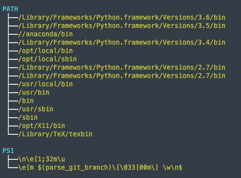

# treenv
Print out environment variables as a tree and in color. Variables are sorted alphabetically by variable name (`PATH` before `USER`), and values with multiple colon-separated fields are printed in their own branch.

I was required to support the use of a `FORMAT` environment variable (grumble...) which, when set to `REVERSE`, displays the neame after the value. In this mode values are _not_ split onto their own lines cause that would be weird.

## Example

